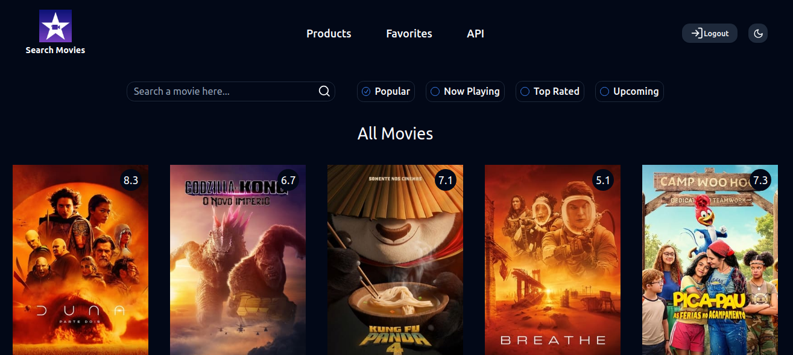

# Movie App

## 🔥 Introdução

Este aplicativo, desenvolvido com a API do TMDB, oferece acesso a um catálogo abrangente com milhares de filmes. Explore lançamentos recentes, sucessos de bilheteria e clássicos atemporais, tudo na palma da sua mão.

### Recursos:

- Pesquisa inteligente: Encontre o filme perfeito para você com nossa barra de pesquisa intuitiva. Digite o título ou explore por gênero, diretor, ator e muito mais.
- Novidades e Destaques: Fique por dentro dos últimos lançamentos e dos filmes mais populares do momento. Nossa seção "Novidades e Destaques" garante que você nunca perca um bom filme.
- Favoritos: Salve seus filmes favoritos para acessá-los facilmente mais tarde. Crie sua própria lista personalizada e compartilhe-a com seus amigos.
- Login seguro: Faça login com segurança usando seu e-mail e senha, conta do Google ou GitHub.

### ⚙️ Pré-requisitos

Caso queira colaborar com o projeto certifique-se que tenha as seguintes tecnologias instaladas e configuradas

```
node
git
```

### 🔨 Guia de instalação

Etapas para instalar:

Passo 1:

```
git clone https://github.com/Darlan0307/Movie-App.git
```

Passo 2:

```
cd movie-app
```

Passo 3:

```
npm install
```

Passo 4:

```
npm run dev
```

## 📦 Tecnologias usadas:

- 
- 
- 
- 
- 
- 
- 

## 💡 Social

- [Meu linkedin](https://www.linkedin.com/in/darlan-martins-8a7956259/)
